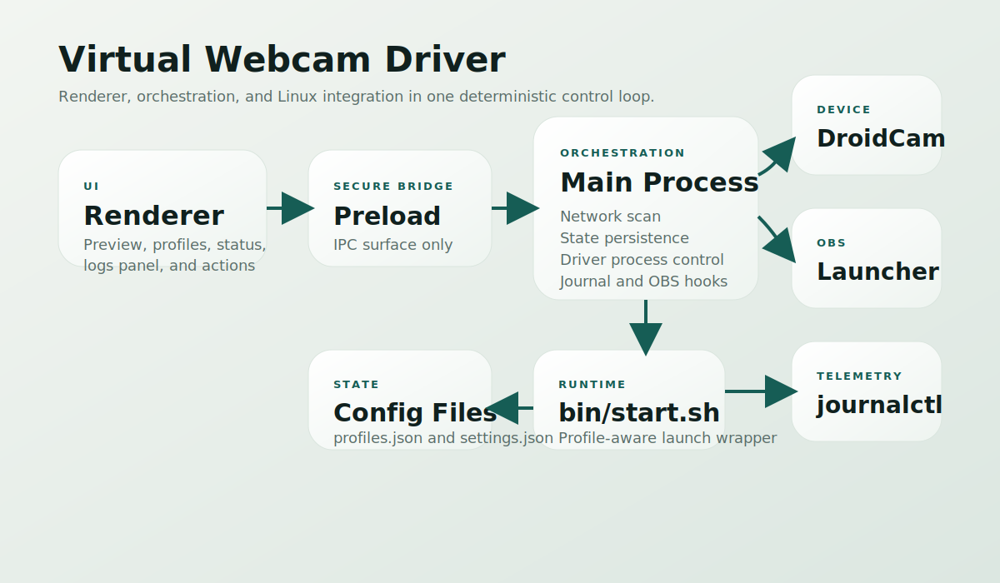
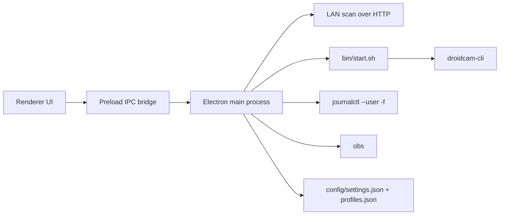

# Virtual Webcam Driver

An Electron control surface for Linux that keeps DroidCam, OBS, and system telemetry in one place.

It stays intentionally narrow:

- Live preview in the app via the DroidCam HTTP stream
- Auto IP detection across local `/24` subnets
- Three deterministic launch profiles: `gaming`, `recording`, `low-latency`
- Journal-aware logs panel with local process logs as fallback
- One-click OBS launch


## Why This Exists

The usual DroidCam workflow on Linux is fragmented:

- find the phone IP manually
- start `droidcam-cli` from a shell
- inspect logs in another terminal
- open OBS separately

This repo collapses that into one control surface without turning it into a bloated streaming suite.

## Architecture





## Features

### Live Preview

The preview panel binds directly to the DroidCam MJPEG feed exposed at `http://<ip>:<port>/video`.

### Auto Detection

The app enumerates non-virtual IPv4 interfaces, derives nearby `/24` subnets, and probes for a DroidCam video endpoint with bounded concurrency.

### Profiles

| Profile | Size | Audio | Use case |
| --- | --- | --- | --- |
| `gaming` | `1280x720` | Off | Stable overhead while OBS is live |
| `recording` | `1920x1080` | On | Higher quality capture |
| `low-latency` | `960x720` | Off | Faster recovery on noisy links |

### Logs Panel

If `virtual-webcam-driver.service` is installed as a user unit, the app follows it with `journalctl --user -f`. If not, the UI still shows the live stdout and stderr from the launched driver process.

### OBS Handoff

`Launch OBS` starts the locally installed `obs` binary without taking over the rest of the workflow.

## Quick Start

```bash
cd virtual-webcam-driver
npm install
npm start
```

For day-to-day use after the first install, you do not need `npm start`.

- Double-click [`Virtual Webcam Driver.desktop`](/home/oghenedoro/Projects/Droid Virtual cam OBS /virtual-webcam-driver/Virtual Webcam Driver.desktop) from the repo folder, or
- Run [`bin/launch-ui.sh`](/home/oghenedoro/Projects/Droid Virtual cam OBS /virtual-webcam-driver/bin/launch-ui.sh)

The launcher uses the local Electron binary directly and writes startup logs to `.logs/launcher.log`.

Requirements:

- Linux
- `droidcam-cli` on `PATH`
- `obs` on `PATH` for the OBS button
- `journalctl` and `systemctl` for service-aware telemetry

## systemd User Service

Copy the example env file and set the repo path plus your target host:

```bash
mkdir -p ~/.config/virtual-webcam-driver
cp config/service.env.example ~/.config/virtual-webcam-driver/service.env
```

Install the user unit:

```bash
mkdir -p ~/.config/systemd/user
cp systemd/virtual-webcam-driver.service ~/.config/systemd/user/
systemctl --user daemon-reload
systemctl --user enable --now virtual-webcam-driver.service
```

The app will detect the unit automatically and start following its journal.

## Screenshot Generation

The repo ships with a vector screenshot for GitHub, and can also generate a PNG from the real Electron UI in demo mode:

```bash
npm run capture:screenshot
```

Output:

- `docs/screenshots/dashboard.png`

## Repo Layout

```text
virtual-webcam-driver/
├── app/                 # Electron main process, preload bridge, renderer UI, styles
├── bin/                 # Runtime launcher for droidcam-cli
├── config/              # Profiles, app settings, and service env example
├── docs/                # Architecture diagram and screenshot assets
└── systemd/             # Optional user service
```
